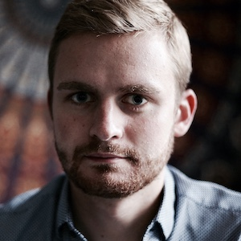
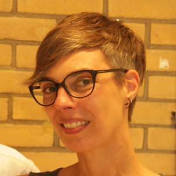

## Welcome

This website provides an overview of our research on visually-grounded language in interactive settings. The work is jointly carried out by our two research groups: the Language and Vision group led by [Raffaella Bernardi](http://disi.unitn.it/~bernardi/) at the University of Trento and the Dialogue Modelling Group led by [Raquel Fernández](https://staff.fnwi.uva.nl/r.fernandezrovira/) at the University of Amsterdam. The two group leaders have equally contributed to all papers included here.

## Contributors

<table id='contributor-table'>
  <tr>
    <td>
      
    </td>
    <td>
      
    </td>
    <td>
      
    </td>
    <td>
      
    </td>
    <td>
      
    </td>
    <td>
      
    </td>
    <td>
      
    </td>
  </tr>
  <tr>
    <td>
      
Tim Baumg&auml;rtner

    </td>
    <td>
      
Raffaella Bernardi

    </td>
    <td>
      
Elia Bruni

    </td>
    <td>
      
Raquel Fern&aacute;ndez

    </td>
    <td>
      
Barbara Plank

    </td>
    <td>
      
Ravi Shekhar

    </td>
    <td>
      
Aashish Venkatesh

    </td>
  </tr>
</table>

## Papers

### Jointly learning to see, ask, decide when to stop, and then GuessWhat
Ravi Shekhar, Alberto Testoni, Raquel Fern&aacute;ndez, and Raffaella Bernardi
#### CLiC-it 2019
> We augment a task-oriented visual dialogue model with a decision-making module that decides which action needs to be performed next given the current dialogue state, i.e. whether to ask a follow-up question or stop the dialogue. We show that, on the GuessWhat?! game, the new module enables the agent to succeed at the game with shorter and hence less
error-prone dialogues, despite a slightly decrease in task accuracy. We argue that both dialogue quality and task accuracy are essential features to evaluate dialogue systems.  

[PDF](http://ceur-ws.org/Vol-2481/paper66.pdf) | [Code](https://github.com/shekharRavi/Beyond-Task-Success-NAACL2019)

### The Devil is in the Detail: A Magnifying Glass for the GuessWhich Visual Dialogue Game
Alberto Testoni, Ravi Shekhar, Raquel Fern&aacute;ndez, and Raffaella Bernardi
#### Semdial 2019
> Grounded conversational agents are a fascinating research line on which important progress has been made lately thanks to the development of neural network models and to the release of visual dialogue datasets. The latter have been used to set visual dialogue games which are an interesting test bed to evaluate conversational agents. Researchers' attention is on building models of increasing complexity, trained with computationally costly machine learning paradigms that lead to higher task success scores. In this paper, we take a step back: We use a rather simple neural network architecture and we scrutinize the GuessWhich task, the dataset, and the quality of the generated dialogues. We show that our simple Questioner agent reaches state-of-the art performance, that the evaluation metric commonly used is too coarse to compare different models, and that high task success does not correspond to high quality of the dialogues. Our work shows the importance of running detailed analyses of the results to spot possible models' weaknesses rather than  aiming to outperform state-of-the-art scores. 
  
[PDF](http://semdial.org/anthology/Z19-Testoni_semdial_0005.pdf) | [Code](https://github.com/shekharRavi/The-Devil-is-in-the-Detail-SemDial2019)  

### Evaluating the Representational Hub of Language and Vision Models
Ravi Shekhar, Ece Takmaz, Raquel Fern&aacute;ndez, and Raffaella Bernardi
#### IWCS 2019
> The multimodal models used in the emerging field at the intersection of computational linguistics and computer vision implement the bottom-up processing of the “Hub and Spoke” architecture proposed in cognitive science to represent how the brain processes and combines multi-sensory inputs. In particular, the Hub is implemented as a neural network encoder. We investigate the effect on this encoder of various vision-and-language tasks proposed in the literature: visual question answering, visual reference resolution, and visually grounded dialogue. To measure the quality of the representations learned by the encoder, we use two kinds of analyses. First, we evaluate the encoder pre-trained on the different vision-and-language tasks on an existing “diagnostic task” designed to assess multimodal semantic understanding. Second, we carry out a battery of analyses aimed at studying how the encoder merges and exploits the two modalities.  

[PDF](https://www.aclweb.org/anthology/W19-0418.pdf) 

### Beyond task success: A closer look at jointly learning to see, ask, and GuessWhat
Ravi Shekhar, Aashish Venkatesh, Tim Baumg&auml;rtner, Elia Bruni, Barbara Plank, Raffaella Bernardi, and Raquel Fern&aacute;ndez
#### NAACL 2019
> We propose a grounded dialogue state encoder which addresses a foundational issue on how to integrate visual grounding with dialogue system components. As a test-bed, we focus on the GuessWhat?! game, a two-player game where the goal is to identify an object in a complex visual scene by asking a sequence of yes/no questions. Our visually-grounded encoder leverages synergies between guessing and asking questions, as it is trained jointly using multi-task learning. We further enrich our model via a cooperative learning regime. We show that the introduction of both the joint architecture and cooperative learning lead to accuracy improvements over the baseline system. We compare our approach to an alternative system which extends the baseline with reinforcement learning. Our in-depth analysis shows that the linguistic skills of the two models differ dramatically, despite approaching comparable performance levels. This points at the importance of analyzing the linguistic output of competing systems beyond numeric comparison solely based on task success.  

[PDF](https://arxiv.org/abs/1809.03408) | [Supplementary Material](https:vista-unitn-uva.github.io/jointly_supplementary.pdf) | [Code](https://github.com/shekharRavi/Beyond-Task-Success-NAACL2019)  

### Ask No More: Deciding when to guess in referential visual dialogue
Ravi Shekhar, Tim Baumg&auml;rtner, Aashish Venkatesh, Elia Bruni, Raffaella Bernardi, and Raquel Fern&aacute;ndez
#### COLING 2018
> Our goal is to explore how the abilities brought in by a dialogue manager can be included in end-to-end visually grounded conversational agents. We make initial steps towards this general goal by augmenting a task-oriented visual dialogue model with a decision-making component that decides whether to ask a follow-up question to identify a target referent in an image, or to stop the conversation to make a guess. Our analyses show that adding a decision making component produces dialogues that are less repetitive and that include fewer unnecessary questions, thus potentially leading to more efficient and less unnatural interactions. 

[PDF](http://aclweb.org/anthology/C18-1104) | [Cite](https://aclanthology.info/papers/C18-1104/c18-1104.bib) | Code coming soon
